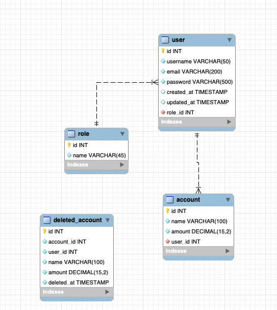

# Database Documentation: useraccount_db

## 1. Introduction
The `useraccount_db` is a MySQL database designed to manage user accounts, their roles (e.g., user, admin), and financial accounts for a hypothetical application. It was designed and documented using MySQL Workbench, which was used to create the Entity-Relationship Diagram (ERD) and forward engineer the schema.

## 2. Entity-Relationship Diagram


The ERD shows three tables: `role`, `user`, and `account`. Relationships are defined by foreign keys: `user.role_id` references `role.id`, linking each user to a single role, and `account.user_id` references `user.id`, allowing each user to have multiple accounts.

## 3. Schema Description
### Table: role
- **Purpose**: Defines user roles (e.g., user, admin).
- **Columns**:
  - `id`: INT, Primary Key, Auto-incremented, Unique identifier for the role.
  - `name`: VARCHAR(45), Not Null, Name of the role (e.g., "user", "admin").

### Table: user
- **Purpose**: Stores user information for authentication and role assignment.
- **Columns**:
  - `id`: INT, Primary Key, Auto-incremented, Unique identifier for the user.
  - `username`: VARCHAR(50), Not Null, Unique, User’s login name.
  - `email`: VARCHAR(200), Not Null, Unique, User’s email address.
  - `password`: VARCHAR(500), Not Null, Hashed password for authentication.
  - `created_at`: TIMESTAMP, Default CURRENT_TIMESTAMP, Record creation time.
  - `updated_at`: TIMESTAMP, Default CURRENT_TIMESTAMP ON UPDATE CURRENT_TIMESTAMP, Record update time.
  - `role_id`: INT, Not Null, Foreign Key to `role.id`, Links user to a role.

### Table: account
- **Purpose**: Stores financial accounts owned by users.
- **Columns**:
  - `id`: INT, Primary Key, Auto-incremented, Unique identifier for the account.
  - `name`: VARCHAR(100), Not Null, Account name (e.g., "Savings Account").
  - `amount`: DECIMAL(15,2), Not Null, Default 0.00, Account balance.
  - `user_id`: INT, Not Null, Foreign Key to `user.id`, Links account to a user.

## 4. Constraints and Relationships
- **Primary Keys**: The `id` column in each table (`role`, `user`, `account`) ensures unique identification of records.
- **Foreign Keys**:
  - `user.role_id` references `role.id`, ensuring each user is assigned a valid role.
  - `account.user_id` references `user.id`, ensuring accounts are linked to valid users.
- **Unique Constraints**:
  - `user.email` prevents duplicate email addresses.
  - `user.username` prevents duplicate usernames.
- **Referential Integrity**: Foreign keys enforce data consistency, preventing orphaned records (e.g., accounts without a valid user).

## 5. Sample Data
The following tables show sample data populated in the database to illustrate its usage.

### role
| id | name  |
|----|-------|
| 1  | user  |
| 2  | admin |

### user
| id | username    | email             | role_id |
|----|-------------|-------------------|---------|
| 1  | john_doe    | john.doe@dls.dk   | 1       |
| 2  | jane_smith  | jane.smith@dls.dk | 1       |
| 3  | admin_user  | admin@dls.dk      | 2       |

### account
| id | name              | amount  | user_id |
|----|-------------------|---------|---------|
| 1  | Savings Account   | 5000.50 | 1       |
| 2  | Checking Account  | 500.25  | 1       |
| 3  | Savings Account   | 2000.75 | 2       |
| 4  | Admin Account     | 10000.00| 3       |

## 6. Sample Query
To demonstrate the database’s functionality, the following query retrieves users, their roles, and their accounts:

```sql
SELECT u.username, r.name AS role, a.name AS account_name, a.amount
FROM user u
JOIN role r ON u.role_id = r.id
LEFT JOIN account a ON a.user_id = u.id;